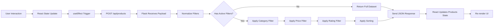

# E-Commerce Product Multi-Filter System

A production-grade product catalog with **server-side filtering, sorting, and combinatorial logic**. Built with Flask (backend) and React (frontend) following strict architectural constraints.


## 🎯 System Architecture

### Core Principles

1. **Server-Side Processing**: All filtering, sorting, and data manipulation happens on the Flask backend
2. **Instant Feedback**: Frontend triggers API calls on every filter change (no submit button)
3. **Combinatorial Logic**: Products must satisfy ALL active filter criteria simultaneously
4. **Graceful Degradation**: Empty filters return the full dataset without errors

---

## 🏗️ Technical Implementation

### Backend (Flask)

**File**: `app.py`

**Key Features**:
- ✅ **100+ Product Dataset**: Dynamically generated catalog with realistic data
- ✅ **Combinatorial Intersect Filtering**: Multi-criteria evaluation (categories, price, rating)
- ✅ **Null-Safe Processing**: Returns full inventory when filters are empty
- ✅ **Server-Side Sorting**: `price_low_to_high`, `top_rated_first`, `featured`
- ✅ **Type Normalization**: Gracefully handles string/number conversions
- ✅ **CORS Enabled**: Configured for cross-origin requests

**API Endpoint**:
```http
POST /api/products
Content-Type: application/json

{
  "categories": ["Electronics", "Footwear"],
  "min_price": 50,
  "max_price": 150,
  "min_rating": 4.0,
  "sort_by": "price_low_to_high"
}
```

**Response**:
```json
{
  "products": [...],
  "count": 42,
  "filters": {
    "categories": ["Electronics", "Footwear"],
    "min_price": 50,
    "max_price": 150,
    "min_rating": 4.0,
    "sort_by": "price_low_to_high"
  }
}
```

### Frontend (React)

**File**: `ProductCatalog.jsx`

**Key Features**:
- ✅ **Instant State Transmission**: `useEffect` triggers API call on filter changes
- ✅ **Multi-Select Categories**: Checkbox-based category filtering
- ✅ **Dual Price Sliders**: Independent min/max price range controls
- ✅ **Star Rating Filter**: Radio button selection (0, 3, 4, 4.5, 5 stars)
- ✅ **Sort Dropdown**: Client-side UI, server-side execution
- ✅ **Empty State Handling**: "No items match" screen with reset button
- ✅ **Dark/Light Theme**: System-aware theme switching
- ✅ **URL State Persistence**: Filter state synced to query parameters

**UI Components**:
1. **Sticky Sidebar** (left): All filter controls
2. **Product Grid** (right): Dynamic card layout
3. **Sort Bar**: Positioned above product grid
4. **Theme Toggle**: Top-right header button

---

## 📦 Installation & Setup

### Prerequisites
- Python 3.8+
- Node.js 16+
- npm or yarn

### Backend Setup
```bash
# Install Python dependencies
pip install flask flask-cors

# Run Flask server
python app.py

# Server runs on http://127.0.0.1:5000
```

### Frontend Setup
```bash
# Install Node dependencies
npm install

# Run development server
npm run dev

# Frontend runs on http://localhost:5173
```

---

## 🧪 Running Integration Tests

Comprehensive test suite covering:
- ✅ Null filter handling (returns full dataset)
- ✅ Combinatorial intersect logic (AND conditions)
- ✅ Tight boundary conditions (edge cases)
- ✅ Server-side sorting pipeline
- ✅ Zero results scenarios
- ✅ Multiple category unions (OR logic)
- ✅ Input validation and type normalization

**Run Tests**:
```bash
# From project root
python tests/test_filter_integration.py

# Or using unittest directly
python -m unittest tests.test_filter_integration
```

**Expected Output**:
```
test_combinatorial_intersect_filtering ... ok
test_data_type_normalization ... ok
test_multiple_categories_union ... ok
test_null_filters_return_full_dataset ... ok
test_server_side_sorting_pipeline ... ok
test_tight_limit_conditions ... ok
test_zero_results_scenario ... ok

======================================================================
INTEGRATION TEST SUMMARY
======================================================================
Tests Run: 7
Successes: 7
Failures: 0
Errors: 0
======================================================================
```

---

## 🎨 Design Philosophy

### Aesthetic Principles
1. **Glassmorphism**: Backdrop blur with transparency layers
2. **Depth Through Shadows**: Multi-level shadow hierarchy
3. **Smooth Transitions**: 300ms duration on state changes
4. **Visual Feedback**: Active filters highlighted with color/borders
5. **Responsive Layout**: Mobile-first grid system
6. **Accessibility**: ARIA labels, keyboard navigation, focus states

### Color System
- **Primary**: Cyan (`#22D3EE`) - CTAs and active states
- **Dark Theme**: Slate 900/950 backgrounds with cyan accents
- **Light Theme**: White/slate 100 backgrounds with cyan accents
- **Typography**: System font stack with proper hierarchy

---

## 📊 Data Flow Diagram



---

## 🚀 Performance Optimizations

1. **Memoization**: `useMemo` for active filter count
2. **Debouncing**: Potential for slider input optimization
3. **Lazy Loading**: Images loaded on-demand with Unsplash CDN
4. **Component Chunking**: Modular sidebar/grid separation
5. **Server-Side Efficiency**: Single-pass filtering algorithm

---

## 📝 Requirements Checklist

### ✅ Backend Requirements
- [x] Combinatorial intersect filtering (ALL conditions must match)
- [x] Graceful null handling (empty filters = full dataset)
- [x] Server-side sorting pipeline (filter → sort)
- [x] Structured REST API with JSON responses
- [x] 100+ product mock dataset
- [x] Category, price, rating filters
- [x] Type normalization and validation

### ✅ Frontend Requirements
- [x] Instant state transmission (no submit button)
- [x] Category checklist (multi-select)
- [x] Dual price range sliders (min/max)
- [x] Star rating radio buttons (0, 3, 4, 4.5, 5)
- [x] Sort dropdown with server execution
- [x] Empty state with reset functionality
- [x] Responsive Tailwind CSS design
- [x] Dark/light theme support

### ✅ Additional Features
- [x] URL state persistence (shareable filters)
- [x] Theme toggle with localStorage
- [x] Active filter count indicator
- [x] Visual feedback on selections
- [x] Accessibility features (ARIA, keyboard nav)
- [x] Integration test suite (7 test cases)

---

## 🔧 Configuration

### Backend Settings
```python
# app.py
app.config["JSON_SORT_KEYS"] = False  # Preserve key order
app.run(debug=True, host="0.0.0.0", port=5000)
```

### Frontend Constants
```javascript
// ProductCatalog.jsx
const DEFAULT_MIN_PRICE = 0;
const DEFAULT_MAX_PRICE = 250;
const DEFAULT_MIN_RATING = 0;
const DEFAULT_SORT = 'featured';
const CATEGORY_OPTIONS = ['Electronics', 'Footwear', 'Accessories', 'Apparel', 'Home'];
```

---

## 🐛 Troubleshooting

### CORS Errors
**Issue**: Frontend can't connect to backend  
**Solution**: Ensure Flask CORS headers are enabled (already configured in `app.py`)

### Port Conflicts
**Issue**: Port 5000 already in use  
**Solution**: Change Flask port in `app.py` or kill existing process

### Filter Not Working
**Issue**: Changes don't trigger API call  
**Solution**: Check browser console for errors; verify Flask server is running

### Dark Mode Not Persisting
**Issue**: Theme resets on page reload  
**Solution**: localStorage should handle this automatically; check browser settings

---

## 📄 License

MIT License - Free to use for learning and commercial projects.

---

## 🤝 Contributing

This is a demonstration project showcasing production-grade architecture patterns. Feel free to fork and extend!

---

## 📧 Support

For issues or questions, refer to the comprehensive test suite in `tests/test_filter_integration.py` which documents expected behavior for all edge cases.

---

**Built with ❤️ using Flask, React, and Tailwind CSS**
